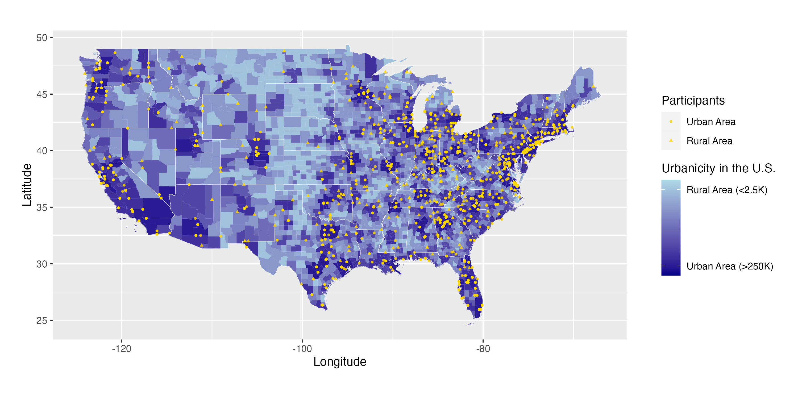

In this project, I visualized data to investigate the effectiveness of utilizing social media-based advertisements and content for the purpose of involving rural adolescents experiencing increased depression symptoms in a randomized trial examining single-session interventions (SSIs).

<!--more-->

## 1 Overview


Using data from [a previously-completed clinical trial](https://osf.io/8mk6x/), I was curious does instagram-based recruitment led to nationally-representative samples of youth living in both rural and urban area in the U.S.?


## 2 Workflow

* Import and preprocess data from the clinical trial
* Import and preprocess county-level map data
* Combine datasets
* Visualize the map with county-level distribution
* Statistical analysis

## 3 Visualization & Analysis!

### 3-1 Visualization 

In this project, I utilized the `maps` package to obtain comprehensive U.S. map data, encompassing information on continents, countries, and states. Subsequently, I employed the `geom_polygon()` function from the ggplot2 package to create a detailed visualization of the U.S. map, which included the delineation of regional boundaries.

The project's repository is: https://github.com/yamachang/cope_rurality.

Please open the code block below to view the code for visualizing U.S. map here :(far fa-hand-point-down fa-fw)::

```r
### Plotting!

plot_rucc2013 <- ggplot(map_df_usa1, aes(x = Longitude, y = Latitude, group = group)) +
  geom_polygon(aes(fill = rucc_2013)) +
  scale_fill_continuous(name = "Urbanicity in the U.S.", low = "darkblue", 
            high = "lightblue", limits = c(0,10), breaks = c(1,9), 
            labels = c("Urban Area (>250K)","Rural Area (<2.5K)"),
            na.value = "grey50") +
  geom_path(data = map_state1, colour = "white", size= .1) +
  geom_point(data = map_of_participants_3, mapping = aes(x = Longitude, y = Latitude, shape = as.factor(rucc_bi)), size = 0.85, color = "gold", alpha = 0.8) + 
  scale_shape_discrete(name = "Participants", labels = c("Urban Area","Rural Area")) + 
  coord_quickmap() +
  theme(legend.margin = margin(t = 0, r = 20, b = 0, l = 20, unit = "pt"),
        plot.margin = margin(t = 0, r = 0, b = 0, l = 20, unit = "pt"))
        
```

 

### 3-2 Statistical Analysis

To evaluate the treatment effectiveness of digital single-session interventions (SSIs) on depressive symptoms among rural and urban adolescents, I modeled the change in depressive symptoms assessed at baseline and at a 3-month follow-up. The chosen model was multiple linear regression, which included rurality (assessed continuously), type of intervention (across three levels), demographic covariates, and the interaction of rurality with depression scores at baseline as predictors of depressive symptom severity from baseline to the 3-month follow-up (i.e., rurality x baseline depression scores).

 on depressive symptoms as moderated by rurality at 3-month follow up") 


